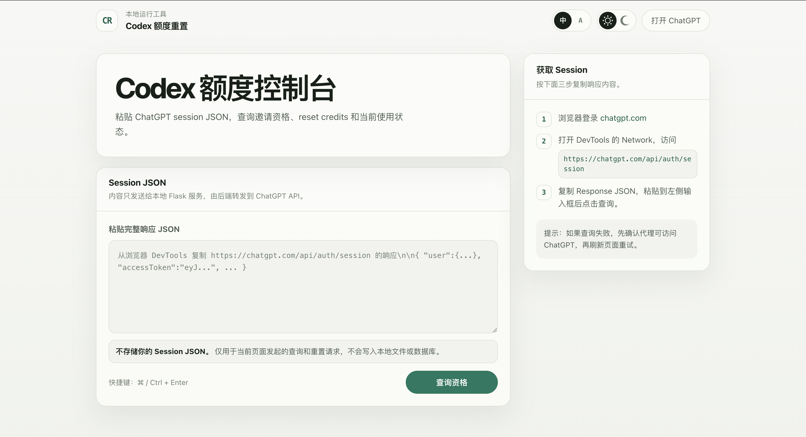
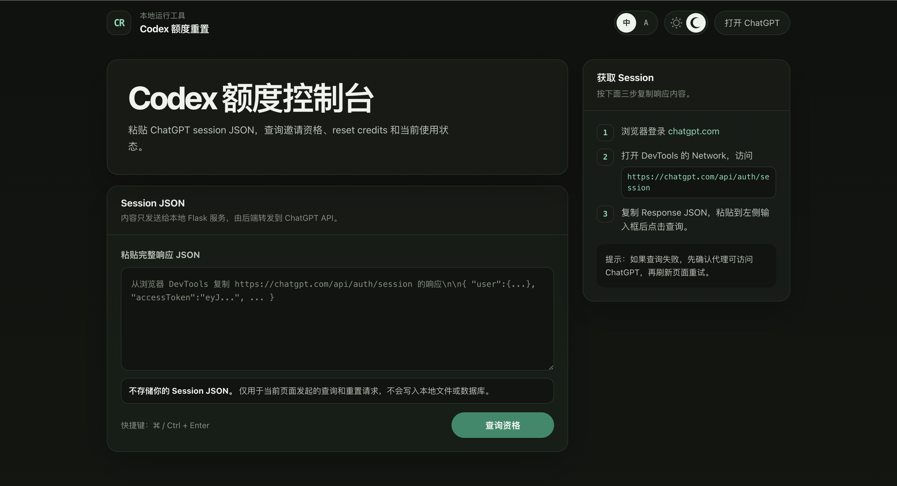

# Codex Reset Credits

A local Codex credits console for checking ChatGPT Codex invite eligibility, viewing reset credits, sending invites, and consuming available reset credits.

[简体中文](README.md)

## Preview





## Features

- Check Codex invite eligibility
- Query rate limit reset credits
- Consume an available reset credit to reset your limit
- View current usage status
- Send invite emails when your account is eligible
- Switch between Chinese and English
- Switch between light and dark themes
- Open `https://chatgpt.com/api/auth/session` directly from the page
- Session JSON is not stored and is only used for local page actions

## Local Setup

```bash
python3 -m venv .venv
source .venv/bin/activate
pip install flask curl_cffi
python3 app.py
```

Open:

```text
http://localhost:8080
```

If port `8080` is already in use, run it with another port:

```bash
PORT=8081 python3 app.py
```

## Proxy

The app uses this local proxy by default:

```python
PROXIES = {"https": "http://127.0.0.1:10808", "http": "http://127.0.0.1:10808"}
```

If your proxy port or protocol is different, update `PROXIES` in `app.py`. For Clash, V2Ray, or other local proxy tools, make sure the backend can reach `chatgpt.com`.

## How To Get Session JSON

1. Sign in at [chatgpt.com](https://chatgpt.com)
2. Open the DevTools Network panel
3. Visit [https://chatgpt.com/api/auth/session](https://chatgpt.com/api/auth/session)
4. Copy the full Response JSON
5. Paste it into the input box and click "Check eligibility"

## Privacy And Security

- The page does not write Session JSON to local files or a database
- Session JSON is sent only to the local Flask service
- The backend uses the `accessToken` from the session to call the ChatGPT API
- Do not expose this app directly to the public internet
- If you deploy it on a server, add access control, HTTPS, proxy configuration, and log redaction

## Tech Stack

- **Frontend**: plain HTML / CSS / JavaScript
- **Backend**: Flask + curl_cffi
- **Requests**: ChatGPT API calls with Chrome-like TLS impersonation
- **UI**: responsive layout with Chinese / English and light / dark themes

## API Endpoints

| Feature | ChatGPT API |
| --- | --- |
| Invite eligibility | `GET /backend-api/referrals/invite/eligibility` |
| Reset credits | `GET /backend-api/wham/rate-limit-reset-credits` |
| Consume reset credit | `POST /backend-api/wham/rate-limit-reset-credits/consume` |
| Usage status | `GET /backend-api/wham/usage` |
| Send invite | `POST /backend-api/wham/referrals/invite` |

## Upstream

Forked from [LImingcheng07/codex-reset](https://github.com/LImingcheng07/codex-reset).
